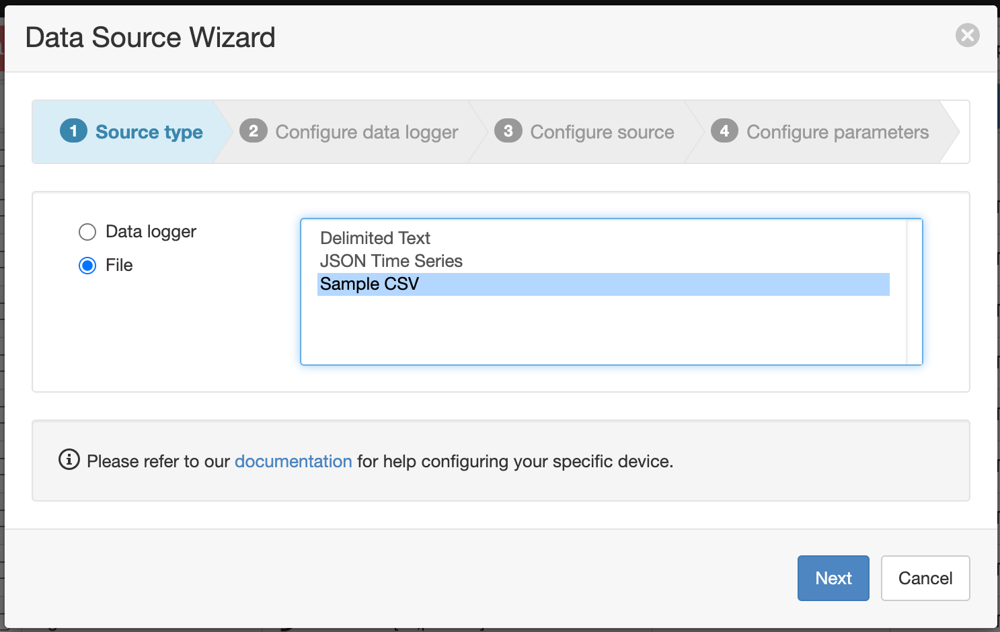

# converter

This project contains source code and supporting files for constructing eagle.io converters. A `converter` provides a method to transform files acquired by eagle.io prior to ingestion; this allows greater flexibility to handle formats not compatible with the built-in platform visual parsing tools.

A `converter` for a specific *format* can be contributed as a [Pull Request](https://docs.github.com/en/pull-requests) to this repository and should consist of three files:

| File | Description |
|------|-------------|
| `lib/{format}/{format}-converter.ts` | a [TypeScript](https://www.typescriptlang.org) class that extends [Converter](converter.ts); bytes are supplied to the `convert` function as a `Buffer`, transformed by your code, and returned as a [JtsDocument](https://github.com/eagle-io/timeseries/blob/master/src/JtsDocument.ts) |
| `lib/{format}/test/input.dat` | an example of the format to be transformed; may consist of binary or text data |
| `lib/{format}/test/{format}-converter.test.ts` | one or more unit tests that prove your converter faithfully transforms the input format to [JTS](https://docs.eagle.io/en/latest/reference/historic/jts.html)  |

NOTE: The format name you choose should be short and descriptive.

An example converter can be found under `lib/sample` and is a good starting point for your converter. [JtsDocument](https://github.com/eagle-io/timeseries/blob/master/src/JtsDocument.ts) construction is aided by the [@eagle-io/timeseries](https://github.com/eagle-io/timeseries) library.

Once your `converter` has been submitted and approved, your format will be available from the Data Source wizard.


### Required tools
- Node.js 16.x

### Getting started
- [Fork](https://github.com/eagle-io/converter/fork) this repository
- Clone your fork locally
- Run `npm install` to ensure all packages are available
- Add your `converter` and associated test files
- Commit and push your changes
- Submit a [Pull Request](https://github.com/eagle-io/converter/compare)
- Wait for eagle.io to review your submission

Tests are written in [Jest](https://jestjs.io) and can be executed as follows:
```
npm run test
```
